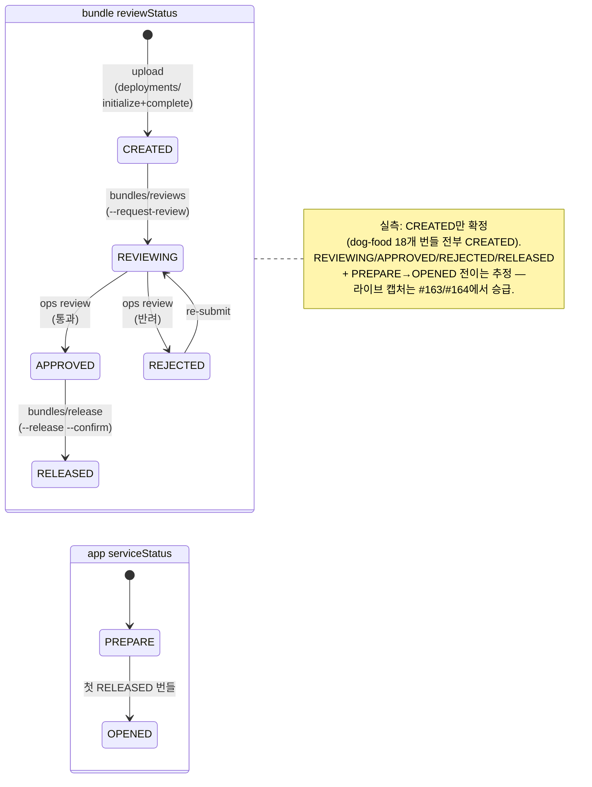

# Mini-apps · Bundles · Deployments

`<base>` = `https://apps-in-toss.toss.im/console/api-public/v3/appsintossconsole`

미니앱 번들(빌드 결과 zip/AIT)의 업로드, 검토, 배포 endpoint 묶음. 자세한 번들 포맷(AIT vs legacy zip)은 console-cli `CLAUDE.md`의 "App deploy" 섹션 참고.

> **Capture status note**: GET 엔드포인트 두 개(`bundles` 목록 / `bundles/deployed`)는 2026-05-11 31146 + 잔여 dog-food 앱(29349/29405)에서 실호출 envelope을 직접 캡처해 ✅로 승급했다. `bundles/test-links`는 같은 라운드에서 사전 번들 부재 시의 4000 error path만 확인 — success shape은 미보유라 ⚠️ 유지. deploy write 경로(`deployments/initialize` + `complete`, = `app deploy` 기본)는 2026-05-22 31146에서 ✅로 승급했다 — 31146의 등록 검수 lock이 풀려(`aitcc app status` → `state: approved`, `locked: false`) 번들 18개가 실트래픽으로 deploy됐고, `bundles ls`가 그 record를 반환한다(아래 "31146 deploy 캡처 결과" + record shape). 나머지 write 경로(`reviews`/`release`/`reviews/withdrawal`/`memos`/`test-push`)는 여전히 라이브 캡처 미보유 — 18개 번들이 전부 `reviewStatus: CREATED`(출시 검수 미제출)에 머물러 있어 출시 검수 제출(#164)이 들어가야 본문이 잡힌다. 미캡처 항목의 본문 shape은 [`src/api/mini-apps.ts`](../../src/api/mini-apps.ts), [`src/commands/app-deploy.ts`](../../src/commands/app-deploy.ts)의 inferred 모델 + 콘솔 번들 정적 분석(`bootstrap.*.js` grep, [`.playwright-mcp/ENDPOINTS-CATALOG.md`](https://github.com/apps-in-toss-community/.playwright-mcp/) 참고) 기준으로 유지.

## 색인

### Bundles (번들)

| Method | Path | 용도 | 상태 |
|---|---|---|---|
| GET | `/workspaces/<wid>/mini-app/<mini_app_id>/bundles` | 번들 목록 | ✅ |
| GET | `/workspaces/<wid>/mini-app/<mini_app_id>/bundles/deployed` | 현재 배포된 번들 | ✅ |
| POST | `/workspaces/<wid>/mini-app/<mini_app_id>/bundles/release` | 번들 릴리즈 | ⚠️ |
| POST | `/workspaces/<wid>/mini-app/<mini_app_id>/bundles/reviews` | 번들 심사 요청 | ⚠️ |
| POST | `/workspaces/<wid>/mini-app/<mini_app_id>/bundles/reviews/withdrawal` | 심사 철회 | ⚠️ |
| GET | `/workspaces/<wid>/mini-app/<mini_app_id>/bundles/test-links` | 테스트 링크 조회 | ⚠️ |
| POST | `/workspaces/<wid>/mini-app/<mini_app_id>/bundles/test-push` | 테스트 배포 (푸시) | ⚠️ |
| POST | `/workspaces/<wid>/mini-app/<mini_app_id>/bundles/memos` | 번들 메모 | ⚠️ |

### Deployments (배포 트랜잭션)

| Method | Path | 용도 | 상태 |
|---|---|---|---|
| POST | `/workspaces/<wid>/mini-app/<mini_app_id>/deployments/initialize` | 배포 초기화 (업로드 URL 발급) | ✅ |
| POST | `/workspaces/<wid>/mini-app/<mini_app_id>/deployments/complete` | 배포 완료 (uploaded 검증) | ✅ |

## 흐름 (CLI `app deploy` 기준)

CLI [`src/commands/app-deploy.ts`](../../src/commands/app-deploy.ts)가 묶는 단계:

1. **번들에서 `deploymentId` 자동 추출** — AIT 헤더 protobuf field 2 또는 legacy zip의 `app.json._metadata.deploymentId`. CLI 로컬 처리, 서버 콜 없음.
2. **`POST .../deployments/initialize`** — 응답으로 업로드용 pre-signed URL을 받음 (추정 — 라이브 캡처 미보유).
3. **번들 바이너리 업로드** — pre-signed URL로 직접 PUT.
4. **`POST .../deployments/complete`** — 업로드 완료를 서버에 알림. 응답으로 `bundleId` 등을 받음 (추정).
5. (옵션) **`POST .../bundles/reviews`** with `--request-review --release-notes <text>`.
6. (옵션) **`POST .../bundles/release`** with `--release --confirm` — bundle이 APPROVED 상태일 때만 동작.

## 번들 출시 상태머신

번들 출시 검수는 *앱 등록 검수*([`mini-apps.md`](./mini-apps.md) "동작 (`approvalType` 별)")와 **별개의 상태머신**이다 — 둘은 독립적으로 진행된다. 앱 등록이 `approved`여도 번들이 출시 검수를 통과하지 못하면 `serviceStatus`는 `PREPARE`에 머문다. 두 층의 관계는 [`mini-apps.md`](./mini-apps.md) "sdk-example dog-food 앱 상태" 참조.

번들의 `reviewStatus`(개별 deployment 단위)와 앱의 `serviceStatus`(앱 전체 단위)가 맞물려 전이한다:



상태별 의미:

| reviewStatus | 의미 | 트리거 | serviceStatus 영향 |
|---|---|---|---|
| `CREATED` | 업로드만 됨, 출시 검수 미제출 | `deployments/initialize` + `complete` (= `app deploy` 기본) | 없음 — `PREPARE` 유지 |
| `REVIEWING` | 출시 검수 큐 진입 (추정 라벨) | `bundles/reviews` (`--request-review`) | 없음 |
| `APPROVED` | 출시 검수 통과 — release 가능 | 운영팀 검수 | 없음 (release 전) |
| `REJECTED` | 출시 검수 반려 | 운영팀 검수 | 없음 |
| `RELEASED` | 실제 배포 — 사용자 노출 | `bundles/release` (`--release --confirm`) | 첫 RELEASED → `serviceStatus: OPENED` |

> `CREATED`는 실측 라이브 값이다 — 2026-05-22 `bundles ls`가 dog-food 18개 번들의 `reviewStatus`를 전부 `CREATED`(출시 검수 미제출)로 반환했다. 나머지 enum 라벨(REVIEWING/APPROVED/REJECTED/RELEASED)과 `serviceStatus: OPENED` 전이는 아직 **추정** — 18개가 전부 `CREATED`에 머물러 있어 전이 자체의 라이브 캡처가 없다. `initialize` 응답의 `reviewStatus`는 `PREPARE`로 실측됐다([`app-deploy.ts`](../../src/commands/app-deploy.ts) `init.reviewStatus !== 'PREPARE'` 게이트). 첫 출시 검수 제출(#164) 후 이 다이어그램의 추정 라벨을 실측으로 승급한다.

`serviceStatus`의 라이브 값을 `OPENED`로 보는 근거는 [`mini-apps.md`](./mini-apps.md) "sdk-example dog-food 앱 상태" + umbrella `CLAUDE.md` §3.2 — CLI의 `describeServiceStatus`/`deriveLsStatus`는 `OPENED`와 `RUNNING`을 둘 다 in-service로 처리한다([`app.ts`](../../src/commands/app.ts), 실측 미확인 주석 참조).

## `GET /workspaces/<wid>/mini-app/<mini_app_id>/bundles` — 번들 목록

- **Used by**: [`src/api/mini-apps.ts#fetchBundles`](../../src/api/mini-apps.ts), CLI `aitcc app bundles ls`
- **Capture status**: ✅ confirmed (dog-food: 31146 / 29349 / 29405 @ 2026-05-11, 모두 빈 페이지)
- **Auth**: 세션 쿠키
- **Query params** (모두 optional):
  - `page` — 0-indexed page 번호 (생략 시 0)
  - `tested` — `true` | `false` 문자열. TESTED-only로 좁힘
  - `deployStatus` — 예: `DEPLOYED`. live 번들로 좁힘

### Server raw response (HTTP 200, 빈 케이스)

```json
{
  "resultType": "SUCCESS",
  "success": {
    "contents": [],
    "totalPage": 0,
    "currentPage": 0
  }
}
```

페이지-기반 pagination (`{contents, totalPage, currentPage}`) — `app reports`의 cursor 기반(`{reports, nextCursor, hasMore}`) 또는 `notices`의 1-indexed page와 다른 패턴이다. [`_conventions.md`](./_conventions.md) "Pagination" 표 참조.

`tested=true`/`deployStatus=DEPLOYED` 필터를 붙여도 동일 envelope 반환 (31146에서 확인) — 매칭 결과가 없으면 그냥 `contents: []`.

### CLI `--json` output

```json
{"ok":true,"workspaceId":3095,"appId":31146,"page":0,"totalPage":0,"currentPage":0,"bundles":[]}
```

번들 record가 채워진 케이스(populated `contents[]`)는 sdk-example dog-food 5개 앱 모두 업로드 history가 없어 미보유. 콘솔 번들 정적 분석상 individual record는 `{deploymentId, status, deployStatus, tested, createdAt, ...}` 형태로 추정.

## `GET /workspaces/<wid>/mini-app/<mini_app_id>/bundles/deployed` — 현재 배포된 번들

- **Used by**: [`src/api/mini-apps.ts#fetchDeployedBundle`](../../src/api/mini-apps.ts), CLI `aitcc app bundles deployed`
- **Capture status**: ✅ confirmed (dog-food: 31146 / 29349 / 29405 @ 2026-05-11, 모두 null)
- **Auth**: 세션 쿠키

### Server raw response (HTTP 200, 미배포 케이스)

```json
{ "resultType": "SUCCESS", "success": null }
```

singular 경로 (`/bundles/deployed`, list `/bundles`와 구분). 첫 deploy가 들어가기 전까지 `success: null`. populated record shape은 첫 release 이후 갱신 필요.

### CLI `--json` output

```json
{"ok":true,"workspaceId":3095,"appId":31146,"bundle":null}
```

## `GET /workspaces/<wid>/mini-app/<mini_app_id>/bundles/test-links` — 테스트 링크 조회

- **Used by**: [`src/api/mini-apps.ts#fetchBundleTestLinks`](../../src/api/mini-apps.ts), CLI `aitcc app bundles test-links`
- **Capture status**: ⚠️ partial (success shape 미보유 — 사전 조건 없는 호출의 4000 에러 응답만 확인. 31146 @ 2026-05-11)
- **Auth**: 세션 쿠키

### Observed error response (HTTP 400)

테스트 가능한 번들이 없는 상태(31146는 한 번도 업로드 없음)에서 호출 시:

```json
{
  "resultType": "FAIL",
  "error": {
    "reason": "잘못된 요청입니다.",
    "errorCode": "4000"
  }
}
```

코드의 추론된 모델은 "no-arg GET → per-device URL 배열" 이지만, 서버는 호출 prerequisite (테스트 가능한 번들 존재)을 만족하지 않으면 일반화된 4000으로 응답한다. 성공 케이스 shape 캡처는 첫 successful test-push 이후 가능.

### CLI `--json` output (error path)

```json
{"ok":false,"reason":"api-error","status":400,"errorCode":"4000","message":"Toss API error 4000: 잘못된 요청입니다. (HTTP 400)"}
```

Exit code 17 (`api-error`).

## CLI dry-run pre-flight (`aitcc app deploy --dry-run`)

`app deploy --dry-run`은 서버 write를 일으키지 않으면서 실 deploy가 fail할 만한 모든 read-only 검사(번들 parse + workspace/app/session resolve + `members/me` permissions + user/workspace terms)를 수행한다. agent-plugin이 이 출력으로 remediation step을 결정한다.

상세 contract는 [`src/commands/app-deploy.ts`](../../src/commands/app-deploy.ts) 상단의 `--json contract` 주석. 핵심: dry-run은 **항상 exit 0**이고, `wouldSucceed: boolean`이 라이브 deploy가 동일한 사전 검사를 통과할지 알려주는 게이트다.

### Captured output (31146 @ 2026-05-11)

워크스페이스 3095 / 앱 31146 / 외부 .ait 번들로 실행한 결과 (동의 필요한 약관 7개가 blocker로 잡힘):

```json
{
  "ok": true,
  "dryRun": true,
  "wouldSucceed": false,
  "workspaceId": 3095,
  "appId": 31146,
  "deploymentId": "<deployment_id>",
  "bundleFormat": "ait",
  "bytes": 20366007,
  "steps": ["upload"],
  "memo": null,
  "releaseNotes": null,
  "confirmed": false,
  "bundle": {
    "path": "<bundle_path>",
    "format": "ait",
    "deploymentId": "<deployment_id>",
    "embeddedDeploymentId": "<deployment_id>",
    "deploymentIdSource": "bundle",
    "flagMatch": null,
    "size": 20366007
  },
  "context": {
    "workspaceId": 3095,
    "appId": 31146,
    "sessionValid": true,
    "permissions": { "role": "OWNER", "source": "members/me" }
  },
  "terms": {
    "blockers": [
      { "scope": "workspace", "type": "TOSS_LOGIN", "errorCode": 4037, "title": "[제휴용] 개인(신용)정보 보안관리 약정서", "action": "aitcc workspace terms agree TOSS_LOGIN" },
      { "scope": "workspace", "type": "TOSS_LOGIN", "errorCode": 4037, "title": "토스 로그인 약관", "action": "aitcc workspace terms agree TOSS_LOGIN" },
      { "scope": "workspace", "type": "BIZ_WORKSPACE", "errorCode": 4040, "title": "앱인토스 제휴 서비스 이용약관(제휴사용)", "action": "aitcc workspace terms agree BIZ_WORKSPACE" },
      { "scope": "workspace", "type": "BIZ_WORKSPACE", "errorCode": 4040, "title": "[위탁용] 개인(신용)정보 보안관리 약정서", "action": "aitcc workspace terms agree BIZ_WORKSPACE" },
      { "scope": "workspace", "type": "BIZ_WORKSPACE", "errorCode": 4040, "title": "앱인토스 보안점검 약관", "action": "aitcc workspace terms agree BIZ_WORKSPACE" },
      { "scope": "workspace", "type": "IAA", "errorCode": 4099, "title": "TOSS 광고대행 서비스 이용약관", "action": "aitcc workspace terms agree IAA" },
      { "scope": "workspace", "type": "IAP", "errorCode": 5001, "title": "앱인토스 디지털콘텐츠 위탁매매 약관", "action": "aitcc workspace terms agree IAP" }
    ],
    "checked": true
  }
}
```

`steps: ["upload"]` 만 들어가 있는 건 `--request-review` / `--release` 없이 호출했기 때문 — 둘 다 추가하면 `["upload", "review", "release"]` 순서로 채워진다 (`--request-review --release-notes`만 추가한 두 번째 dry-run에서 `["upload", "review"]`까지는 라이브로 확인; `release` 추가는 [`src/commands/app-deploy.ts`](../../src/commands/app-deploy.ts)의 `steps` 빌드에서 확인). `releaseNotes`, `confirmed`, `memo`도 동일 호출에서 같이 echo된다.

`terms.blockers`의 `errorCode` 매핑은 [`_error-codes.md`](./_error-codes.md) "Auth / 약관 family" 표와 1:1 — 라이브 deploy는 첫 번째 blocker가 가리키는 errorCode 그대로 fail한다. blocker 목록은 [`fetchUserTerms`](../../src/api/me.ts) + 5개 워크스페이스 약관 family(`TOSS_LOGIN`, `BIZ_WORKSPACE`, `TOSS_PROMOTION_MONEY`, `IAA`, `IAP` — [`fetchWorkspaceTerms`](../../src/api/workspaces.ts)) 병렬 fetch 결과 — 한 fetch라도 실패하면 `checked: false`로 떨어지고 `terms.blockers`는 빈 배열이 된다. 위 캡처에서 `TOSS_PROMOTION_MONEY`(errorCode 4039)가 빠진 건 이 워크스페이스에 그 family의 required-unagreed 항목이 없어서이지, 누락이 아니다 (해당 fetch는 정상 응답했고 비어 있었다).

`permissions.role`은 `members/me`의 워크스페이스 멤버십에서 derive ([`fetchConsoleMemberUserInfo`](../../src/api/me.ts)). best-effort 체크라 fetch 실패 시 `role: null` + `error` 필드만 채우고 dry-run 자체는 진행한다.

## 31146 deploy 캡처 결과

### 2026-05-11 (GET 경로 + dry-run)

| Endpoint | 시도 | 결과 |
|---|---|---|
| `GET /bundles` | `aitcc app bundles ls 31146` (no filter, `tested=true`, `deployStatus=DEPLOYED` 모두) | `{contents: [], totalPage: 0, currentPage: 0}` ✅ envelope 확정 (당시엔 빈 케이스) |
| `GET /bundles/deployed` | `aitcc app bundles deployed 31146` | `success: null` ✅ envelope 확정 |
| `GET /bundles/test-links` | `aitcc app bundles test-links 31146` | HTTP 400 / errorCode 4000 (사전 번들 없음). 성공 shape 미보유 |
| CLI `app deploy --dry-run --json` | 외부 .ait + 31146 | `wouldSucceed: false`, terms blockers 7개 (TOSS_LOGIN×2, BIZ_WORKSPACE×3, IAA, IAP) 캡처. 위 "Captured output" 섹션. |

29349/29405도 동일 envelope (둘 다 빈 contents + null deployed) — list/deployed 두 GET은 lock 상태와 무관하게 작동한다.

### 2026-05-22 (deploy write 경로 — lock 풀린 뒤 실증)

이전 라운드는 "31146가 등록 검수 lock(4046)에 묶여 destructive write 불가"를 전제로 write 경로를 전부 deferred했다. 그 전제는 더 이상 사실이 아니다 — `aitcc app status 31146`이 `state: approved` · `locked: false` · `lockReason: null`을 보고하고, 그 사이 번들 18개가 `app deploy`로 실트래픽 deploy됐다.

| Endpoint | 시도 | 결과 |
|---|---|---|
| `POST /deployments/initialize` + `complete` | `app deploy` (= 기본 흐름) | ✅ 실증 — 18개 번들이 `CREATED`로 deploy됨 (가장 최근 `versionName: 20260522-18`, `memo: "Release v0.1.9 (dogfood)"`). |
| `GET /bundles` | `aitcc app bundles ls 31146 --json` | ✅ populated record 18건. envelope `{ok, workspaceId, appId, page, totalPage, currentPage, bundles}`. record 필드는 아래. |
| `GET /bundles/deployed` | `aitcc app bundles deployed 31146 --json` | `bundle: null` — `hasCurrent: true`인데도 null. `serviceStatus: PREPARE`라 candidate가 슬롯엔 있지만 출시 검수 통과 전이라 deployed view엔 안 잡힌다 (umbrella `CLAUDE.md` §3.2와 일치). |

**`GET /bundles` record shape** (실측, 18건 동형):

```jsonc
{
  "miniAppId": 31146,
  "appName": "aitc-sdk-example",
  "deploymentId": "019e4bc9-2c68-7c3f-bd77-b170e42e5912",
  "versionName": "20260522-18",
  "lastDeployedAt": null,        // serviceStatus PREPARE → 실제 RELEASED 없음
  "memo": "Release v0.1.9 (dogfood)",
  "releaseNote": null,
  "reviewStatus": "CREATED",     // 18건 전부 CREATED (출시 검수 미제출)
  "reviewReason": null,
  "failureReason": null,
  "isTested": false,             // test-push 0회
  "deployed": false,
  "sdkVersion": "2.5.0",
  "regTs": "2026-05-22T03:25:44",
  "rejectMessages": []
}
```

남은 write 경로(`reviews`/`release`/`reviews/withdrawal`/`memos`/`test-push`)는 lock이 아니라 **아직 안 쳤기 때문에** 미캡처다 — `CREATED → REVIEWING` 전이를 한 번도 트리거하지 않았다. 이 전이는 출시 검수 큐 진입(되돌리기 어려움)이라 #164에서 명시 진행한다.

## TODO: 본문 캡처 필요

deploy write 경로(`initialize`/`complete`)는 위에서 ✅로 승급됐다. 나머지 ⚠️ 항목의 신뢰도를 ✅로 올리려면:

- 검토 요청 시 `reviews` POST의 request body shape (`releaseNotes` 외 `featureList`/`screenshotImagePaths`가 실제 어느 상황에서 채워지는지) + `CREATED → REVIEWING` 전이 응답. (#164)
- 릴리즈 시 `release` POST의 request body / 응답 본문, `contentImages` 필드 사용 사례, 첫 `RELEASED → serviceStatus: OPENED` 전이. (#164)
- `test-push` 응답 shape, `test-links` populated success shape (사전 번들은 이미 18건 있으니 1+ 테스트 device만 추가하면 됨).
- `bundles/memos` 단독 호출 응답 (현재 deploy wrapper에서 묶여서만 호출됨 — `memo` echo는 record에 실측됨).

각 endpoint를 캡처하면 위 "Bundles" 색인의 ⚠️를 ✅로 승급하고, 본 파일을 endpoint별 항목으로 분해해 [`mini-apps.md`](./mini-apps.md)와 같은 형태로 `Request body` / `Server raw response` / `CLI --json output` 섹션을 채울 것.
