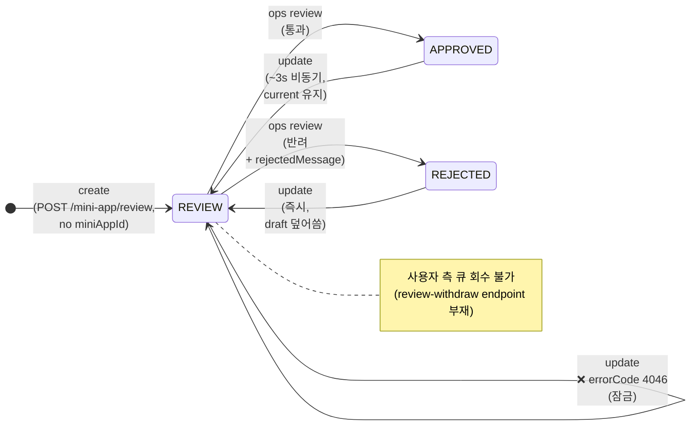

# Mini-apps

`<base>` = `https://apps-in-toss.toss.im/console/api-public/v3/appsintossconsole`

미니앱 등록(검토 제출 포함)과 조회 endpoint 묶음. 이미지 업로드는 별도 → [`mini-app-images.md`](./mini-app-images.md). 번들/배포는 [`mini-app-bundles.md`](./mini-app-bundles.md).

## 색인

| Method | Path | 용도 | 상태 |
|---|---|---|---|
| GET | `/workspaces/<wid>/mini-app` | 워크스페이스 앱 목록 | ✅ |
| GET | `/workspaces/<wid>/mini-app/<mini_app_id>` | 앱 상세 (current view) | ✅ |
| GET | `/workspaces/<wid>/mini-app/<mini_app_id>/with-draft` | 앱 상세 + draft (편집 진입 시) | ✅ |
| POST | `/workspaces/<wid>/mini-app/review` | 앱 등록 + 심사 제출 (원샷) — `miniApp.miniAppId` 포함 시 update mode | ✅ |
| POST | `/workspaces/<wid>/mini-app/pre-review` | AI 사전 검토 (옵션) | ❌ |
| GET | `/workspaces/<wid>/mini-app/<mini_app_id>/review-status` | 개별 앱 심사 상태 | ✅ |
| GET | `/workspaces/<wid>/mini-apps/review-status` | 워크스페이스 전체 앱 심사 상태 요약 | ✅ |
| DELETE | `/workspaces/<wid>/mini-app/<mini_app_id>` | 앱 삭제 (route는 존재, OWNER 세션엔 막힘) | 🚫 |

## `POST /workspaces/<wid>/mini-app/review` — 앱 등록 + 심사 제출 (원샷, dual-mode)

**핵심 endpoint.** 이름과 다르게 단순 review-trigger가 아니라 **create + review submission 일체형**이다. payload 완성도가 충분하면 `검토 중` 상태로 즉시 진입, 부족하면 draft 상태로 남는다. 별도의 review-trigger endpoint는 존재하지 않는다.

**Dual mode** (2026-05-01 dog-food로 확정):

- `miniApp.miniAppId` **부재 → create**. 새 미니앱이 만들어지고 응답 `success.miniAppId`에 새 id가 담긴다.
- `miniApp.miniAppId` **존재 → update**. 그 id의 기존 미니앱의 draft를 덮어쓰고 review 큐로 보낸다. 응답 `success.miniAppId`엔 같은 id가 그대로 돌아온다.

별도 PUT/PATCH endpoint는 존재하지 않는다 — 콘솔 번들(`bootstrap.*.js`)에 mini-app 경로의 PUT/PATCH 호출이 하나도 없고, react-router method enum 외에는 string literal로도 등장하지 않는다. 콘솔의 `/mini-app/<id>/meta/edit` UI도 form 제출 시 동일하게 이 endpoint로 `miniAppId` 포함 POST를 보낸다. update mode의 자세한 동작·제약은 [Update mode 섹션](#update-mode-2026-05-01-확정) 참조.

- **Used by**: [`src/api/mini-apps.ts#createMiniApp`](../../src/api/mini-apps.ts), [`src/commands/register.ts`](../../src/commands/register.ts), [`src/commands/register-payload.ts`](../../src/commands/register-payload.ts)
- **Capture status**: ✅ confirmed (2026-04-22 dog-food, miniAppId 29349/29356/29397/29405)
- **Auth**: 세션 쿠키
- **Request headers**: `Content-Type: application/json`

### Request body

```jsonc
{
  "miniApp": {
    "title": "<app_title_ko>",
    "titleEn": "<app_title_en>",
    "appName": "<app_name>",
    "iconUri": "https://static.toss.im/appsintoss/3095/<image_uuid>.png",
    "darkModeIconUri": null,
    "status": "PREPARE",
    "minAge": 19,
    "maxAge": 99,
    "csEmail": "<email>",
    "description": "<app_subtitle>",          // <= 20 code points
    "detailDescription": "<app_description>",  // <= 500 code points
    "homePageUri": "<home_page_uri>",          // optional, http(s) URL
    "images": [
      { "imageUrl": "https://static.toss.im/appsintoss/3095/<image_uuid>.png", "imageType": "THUMBNAIL", "orientation": "HORIZONTAL", "displayOrder": 0 },
      { "imageUrl": "https://static.toss.im/appsintoss/3095/<image_uuid>.png", "imageType": "PREVIEW",   "orientation": "VERTICAL",   "displayOrder": 1 },
      { "imageUrl": "https://static.toss.im/appsintoss/3095/<image_uuid>.png", "imageType": "PREVIEW",   "orientation": "VERTICAL",   "displayOrder": 2 },
      { "imageUrl": "https://static.toss.im/appsintoss/3095/<image_uuid>.png", "imageType": "PREVIEW",   "orientation": "VERTICAL",   "displayOrder": 3 }
    ]
  },
  "impression": {
    "keywordList": ["<keyword>", "<keyword>"],   // <= 10 entries
    "categoryIds": [3882]                         // 정수 array. {id} 객체 형태 아님
  }
}
```

**필드 메모**:

- `miniApp.iconUri`: 사전에 [`POST /resource/<wid>/upload`](./mini-app-images.md)로 업로드한 이미지 URL.
- `miniApp.images[]`: 같은 업로드 endpoint에서 받은 URL들. **최소 1개의 `THUMBNAIL/HORIZONTAL` + 최소 3개의 `PREVIEW/VERTICAL`** 이 충족돼야 즉시 검토 단계로 진입. 부족하면 draft로 남고 UI에서 추가 입력을 요구한다.
- `impression.categoryIds`: [`/impression/category-list`](./impression.md)의 `categoryList[].id`. 1개 이상 필수. 카테고리 ID에 따라 `subCategory`는 서버가 자동 결정한다 (예: `3882`("정보") 보내면 서버가 `subCategory.id: 56`("뉴스")를 자동 매핑).
- `miniApp.status`: 항상 `"PREPARE"`로 보낸다. 서버는 다른 값을 받지 않는다.
- `miniApp.minAge` / `maxAge`: 콘솔 UI 기본값 19/99 그대로. CLI도 동일.
- `darkModeIconUri`: 명시적 `null` 허용 (생략해도 됨).

### Server raw response (HTTP 200)

서버가 wire 위에서 실제로 보내는 형태:

```json
{ "resultType": "SUCCESS", "success": { "miniAppId": 29397 } }
```

표준 envelope의 `success` 안에 `miniAppId` 하나만. 다른 필드는 없다. 응답이 검수 진입 여부를 직접 알려주지 않으므로, 등록 직후 상태를 알고 싶으면 [`/with-draft`](#-get-workspaceswidmini-appmini_app_idwith-draft--앱-상세--draft) 또는 [`/review-status`](#-get-workspaceswidmini-appmini_app_idreview-status--개별-앱-심사-상태)를 별도 호출한다 (UI도 그렇게 동작).

### CLI `--json` output

[`src/commands/register.ts`](../../src/commands/register.ts)는 위 raw 응답을 unwrap한 뒤 자체 형식으로 다시 wrap해서 stdout으로 출력한다:

```json
{
  "ok": true,
  "workspaceId": 3095,
  "appId": 29405,
  "reviewState": null
}
```

`reviewState: null`이지만 **이게 "검토 미트리거"를 의미하지는 않는다.** payload가 완성되면 UI에서 곧바로 "검토 중이에요. 결과는 영업일 기준 2일 내 이메일로 알려드릴게요." 배너가 뜬다 (29397에서 확인). CLI 응답이 단순히 이 필드를 채우지 않을 뿐 — 서버 응답에도 review 상태는 포함되지 않으므로 필요하면 `app service-status`로 따로 조회한다.

### Error response — server-side validation (HTTP 400, errorCode 4000)

```json
{
  "resultType": "FAIL",
  "error": {
    "reason": "<message>",
    "errorCode": "4000"
  }
}
```

확인된 server-side rules (CLI는 가능한 만큼 [`src/config/app-manifest.ts`](../../src/config/app-manifest.ts) preflight에서 잡지만 일부는 서버에서만 잡힌다):

| 필드 | 규칙 | 메시지 |
|---|---|---|
| `titleEn` | `^[A-Za-z0-9 :]+$` 만 허용 | "앱 영문 이름은 영어, 숫자, 공백, 콜론(:)만 사용 가능해요" |
| `detailDescription` | code point 길이 ≤ 500 | "앱 상세설명은 최대 500자를 넘어갈 수 없어요" |
| `description` (subtitle) | code point 길이 ≤ 20 | (서버 enforce 확인) |
| `appName` | apps-in-toss 전체에서 unique | (중복 시 4000) |
| `images[]` | 최소 PREVIEW/VERTICAL 3장 (검토 진입 조건) | (부족하면 draft 상태로 남음) |

### Drift history

이 endpoint는 한 번 잘못된 가설로 회귀했다가 되돌아온 이력이 있다. 새 명령을 짤 때 추측하지 않도록 요약을 남긴다:

1. **0.1.6**: `{miniApp, impression}` nested + `categoryIds: [number]`. ✅ 정답.
2. **0.1.7**: `{flat...}` + `categoryList: [{id}]`로 회귀. ❌ 4000 발생.
   - 원인: `GET /mini-app/<id>` (current view)를 draft view로 오해해 "필드가 안 들어갔다"고 판단 → payload shape 의심 → 잘못된 회귀.
3. **0.1.8**: 0.1.6 shape으로 복원. ✅ 검수 진입까지 확인 (29397, 29405).
4. 결론: **읽기는 항상 `/with-draft`로**. payload는 위 shape 그대로.

### Update mode (2026-05-01 확정)

create payload에 `miniApp.miniAppId`를 추가하면 update mode가 된다. 같은 endpoint, 같은 payload shape — `miniAppId` 한 필드 유무로 분기.

#### 동작 (`approvalType` 별)

`approvalType`은 envelope의 `success.approvalType` (앱 객체 내부 X). `/with-draft` 응답의 `success`에서 직접 읽는다.



> 자가 전이 `REVIEW → REVIEW`는 실제 상태 변경이 아니라 update 호출이 차단됨을 표현 (HTTP 200 + envelope FAIL).

| 시작 상태 | update 결과 | 동작 |
|---|---|---|
| `APPROVED` (검수 통과, 출시 전/후 무관) | `APPROVED` → `REVIEW` (~3초 지연, 비동기) | `current` (live published, 출시된 경우 사용자 노출) **유지**. 새 변경은 `draft`로 들어가고 `approvalType`이 REVIEW로 flip. live 사용자 영향 없음. 운영팀이 새 draft를 검수 → 통과 시 `current`가 새 내용으로 갱신. |
| `REJECTED` | `REJECTED` → `REVIEW` (즉시) | `current` 없음. `draft`만 존재. update payload가 `draft`를 덮어쓰고 review 큐로 진입. |
| `REVIEW` | ❌ HTTP 200 + `errorCode: 4046` | "검수중인 요청이 있어 검수요청을 할 수 없어요." 운영팀이 검수 결과를 내야 잠금 해제. **사용자가 직접 큐에서 빼는 방법 없음** — `mini-app/review-withdraw` 같은 endpoint는 존재하지 않는다 (콘솔 번들에 `bundles/reviews/withdrawal`, `templates/.../review/withdraw`, `smart-message/.../review-withdraw` 등 다른 도메인 withdraw는 있지만 `mini-app/.../review-withdraw`는 없음). |

#### Update payload (29397 dog-food, 2026-05-01 캡처)

```jsonc
// POST /workspaces/3095/mini-app/review
{
  "miniApp": {
    "miniAppId": 29397,                   // ← presence triggers update mode
    "title": "<app_title_ko>",
    "titleEn": "<app_title_en>",
    "appName": "<app_name>",
    "iconUri": "https://static.toss.im/appsintoss/3095/<image_uuid>.png",
    "darkModeIconUri": null,
    "status": "PREPARE",                   // create와 동일하게 항상 "PREPARE"
    "minAge": 19,
    "maxAge": 99,
    "csEmail": "<email>",
    "description": "<app_subtitle>",
    "detailDescription": "<app_description>",
    "homePageUri": "<home_page_uri>",
    "images": [/* 기존 images 배열 그대로 */]
  },
  "impression": {
    "keywordList": ["<keyword>", ...],
    "categoryIds": [3882]                  // categoryPaths 객체 트리가 아니라 정수 array
  }
}
```

#### Update payload 작성 패턴

콘솔 UI의 `/mini-app/<id>/meta/edit` form은 background save XHR 없이 submit 시점에 form state 전체를 그대로 보낸다. 외부에서도 동일 패턴: **`/with-draft` 응답에서 `draft ?? current`의 `miniApp` + `impression`을 그대로 떠다 변경 필드만 덮어 보낸다.** 부분 update(특정 필드만 보내기)는 미검증 — 안전하게 풀 payload로 보내라.

`impression.categoryIds`는 응답엔 없는 필드라 만들어야 한다 — `impression.categoryPaths[].category.id`를 모아서 array로:

```js
const categoryIds = source.impression.categoryPaths.map(p => p.category.id);
```

#### Response

```json
// HTTP 200
{ "resultType": "SUCCESS", "success": { "miniAppId": 29397 } }
```

create와 같은 shape. 응답이 update vs create인지 구분해 알려주지 않는다 — 호출자가 자기 의도로 안다.

REVIEW 잠금 시:

```json
// HTTP 200 (envelope FAIL)
{
  "resultType": "FAIL",
  "success": null,
  "error": {
    "errorType": 0,
    "errorCode": "4046",
    "reason": "검수중인 요청이 있어 검수요청을 할 수 없어요.",
    "data": {},
    "title": null
  }
}
```

#### CLI 영향

CLI는 아직 update mode를 노출하지 않는다 (`aitcc app register`는 항상 create). update를 다루려면 별도 명령(`aitcc app update`?)이 필요하고, REVIEW 잠금 시 `errorCode: 4046`을 어떻게 사용자에게 surface할지 결정해야 한다 — 현재 `src/api/http.ts`는 `4010`만 `isAuthError`로 별도 처리, 나머지는 generic `TossApiError`. backlog (umbrella TODO).

## `GET /workspaces/<wid>/mini-app` — 앱 목록

- **Used by**: [`src/api/mini-apps.ts#listMiniApps`](../../src/api/mini-apps.ts), `aitcc app ls`
- **Capture status**: ✅ confirmed
- **Auth**: 세션 쿠키
- **Response shape** (current view 기준):

```jsonc
{
  "resultType": "SUCCESS",
  "success": [
    {
      "miniAppId": 29405,
      "workspaceId": 3095,
      "appName": "<app_name>",
      "title": "<app_title_ko>",
      "titleEn": "<app_title_en>",
      "status": "PREPARE",
      "minAge": 19,
      "maxAge": 99,
      "iconUri": "https://static.toss.im/appsintoss/3095/<image_uuid>.png",
      "darkModeIconUri": null,
      "homePageUri": null,
      "description": null,
      "detailDescription": null,
      "csEmail": null,
      "csContract": null,
      "csChatUri": null,
      "gameInfo": null,
      "loginClientId": null,
      "isContest": false,
      "impression": {
        "id": 0,
        "categoryList": [],
        "categoryPaths": [],
        "keywordList": [],
        "isGameCategory": false
      },
      "specialCategory": null,
      "hasHarmfulContent": false,
      "firstReleaseDate": null,
      "images": [],
      "isStatusOpen": false,
      "isGameCategory": false
    }
    // ...
  ]
}
```

**중요**: `PREPARE` 상태 앱들은 위처럼 대부분 필드가 `null`/`[]`인 채로 나타난다. 등록 시 보낸 값을 보려면 `/with-draft`를 사용해야 한다 (아래).

## `GET /workspaces/<wid>/mini-app/<mini_app_id>` — 앱 상세 (current view)

- **Used by**: [`src/api/mini-apps.ts`](../../src/api/mini-apps.ts) (`aitcc app show`의 read path 일부)
- **Capture status**: ✅ confirmed
- **Response**: 단일 앱 객체. `success`는 객체 (배열 X). shape은 위 list와 동일.

이 endpoint는 **검수 통과해 published된 마지막 상태**만 반환한다. 등록 직후 검수 전까지는 대부분 필드가 `null`. 편집/조회 목적이면 `/with-draft`를 우선해야 한다.

## `GET /workspaces/<wid>/mini-app/<mini_app_id>/with-draft` — 앱 상세 + draft

- **Used by**: 등록 직후 상태 확인. `aitcc app status` (계획), `aitcc app show --include-draft` (계획).
- **Capture status**: ✅ confirmed (2026-04-22, miniAppId 29349; 2026-05-01 envelope 필드 보강)
- **Response shape**:

```jsonc
{
  "resultType": "SUCCESS",
  "success": {
    "approvalType": "REVIEW",       // "APPROVED" | "REVIEW" | "REJECTED" — 서버 권위 상태. 앱 객체 내부 X, envelope-level.
    "rejectedMessage": null,        // approvalType === "REJECTED"일 때만 string. 그 외 null.
    "current": null,                // {miniApp, impression} 또는 null. 검수 통과 이력 있을 때만 채워짐.
    "draft": {                       // {miniApp, impression} 또는 null. update/검수 진행 중일 때 채워짐.
      "miniApp": {
        "miniAppId": 29349,
        "workspaceId": 3095,
        "title": "<app_title_ko>",
        "titleEn": "<app_title_en>",
        "appName": "<app_name>",
        "status": "PREPARE",         // 항상 "PREPARE" — published 여부는 firstReleaseDate로 판단.
        "iconUri": "https://static.toss.im/appsintoss/3095/<image_uuid>.png",
        "darkModeIconUri": null,
        "homePageUri": "<home_page_uri>",
        "description": "<app_subtitle>",
        "detailDescription": "<app_description>",
        "csEmail": "<email>",
        "firstReleaseDate": null,    // null = 한 번도 출시 안 함. 출시 후엔 ISO 타임스탬프.
        "isStatusOpen": false,       // 출시 토글 상태로 추정 (미검증).
        "images": [
          { "imageUrl": "https://static.toss.im/appsintoss/3095/<image_uuid>.png", "imageType": "THUMBNAIL", "orientation": "HORIZONTAL", "displayOrder": 0 },
          { "imageUrl": "https://static.toss.im/appsintoss/3095/<image_uuid>.png", "imageType": "PREVIEW",   "orientation": "VERTICAL",   "displayOrder": 1 },
          { "imageUrl": "https://static.toss.im/appsintoss/3095/<image_uuid>.png", "imageType": "PREVIEW",   "orientation": "VERTICAL",   "displayOrder": 2 },
          { "imageUrl": "https://static.toss.im/appsintoss/3095/<image_uuid>.png", "imageType": "PREVIEW",   "orientation": "VERTICAL",   "displayOrder": 3 }
        ]
        // 그 외 필드: minAge, maxAge, csContract, csChatUri, gameInfo, loginClientId, isContest, specialCategory, hasHarmfulContent, isGameCategory
      },
      "impression": {
        "keywordList": ["<keyword>", "<keyword>"],
        "categoryPaths": [
          {
            "group":       { "id": 7,    "name": "생활" },
            "category":    { "id": 3882, "name": "정보" },
            "subCategory": { "id": 56,   "name": "뉴스" }
          }
        ]
      }
    }
  }
}
```

**핵심**:

- `approvalType` + `rejectedMessage`는 **envelope-level** (`success.*`). 미니앱 객체 내부엔 없다 — `bundles`/`templates`처럼 review 객체가 따로 있는 도메인과 구조가 다르다.
- `current`/`draft`는 둘 다 `{miniApp, impression}` 형태. update mode 작성 시 `draft ?? current`에서 떠다 쓰면 둘 다 커버.
- `current`는 검수 통과 이력 없으면 `null`. 출시(release) 안 했어도 검수만 통과했으면 채워짐 (단 `firstReleaseDate`는 출시 전까지 `null`).
- `draft.miniApp`이 등록 시 보낸 모든 필드를 그대로 들고 있다. `categoryPaths`는 서버가 `categoryIds`로부터 자동 매핑해 만든 객체 트리.

#### `approvalType` × `current` × `draft` 매트릭스 (관찰된 조합)

| approvalType | current | draft | 의미 |
|---|---|---|---|
| `REVIEW` | `null` | `{...}` | 첫 검수 진행 중 (create 직후 또는 REJECTED → update). |
| `REVIEW` | `{...}` | `{...}` | 통과한 적 있고 update로 다시 검수 큐 진입 (변경된 부분은 `draft`). |
| `APPROVED` | `{...}` | `null` | 검수 통과한 clean 상태 (변경 없음). |
| `APPROVED` | `{...}` | `{...}` | 미검증 — 통과 후 update 직후 ~3초 동안의 transient 상태로 추정. 정상화되면 `REVIEW` + `current` 유지로 flip. |
| `REJECTED` | `null` | `{...}` | 첫 검수에서 반려. `rejectedMessage`에 사유. |
| `REJECTED` | `{...}` | `{...}` | 미관찰. |

#### CLI 활용 (`aitcc app status` 계획)

`approvalType` + `current.firstReleaseDate` + `draft` 조합으로 사용자 친화 상태를 derive:

- `approvalType: "REVIEW"` → "검수 중"
- `approvalType: "REJECTED"` → "반려: \<rejectedMessage>"
- `approvalType: "APPROVED" && current.firstReleaseDate == null` → "검수 통과 — 출시 대기"
- `approvalType: "APPROVED" && current.firstReleaseDate != null` → "출시 중"

서버 권위 상태가 필요하면 별도로 [`/review-status`](#-get-workspaceswidmini-appmini_app_idreview-status--개별-앱-심사-상태)를 호출한다.

## `GET /workspaces/<wid>/mini-app/<mini_app_id>/review-status` — 개별 앱 심사 상태

- **Used by**: [`src/api/mini-apps.ts`](../../src/api/mini-apps.ts), `aitcc app service-status` (singular path)
- **Capture status**: ✅ confirmed
- **응답**: 워크스페이스 전체 review-status의 단일 항목 형태. shape은 아래 워크스페이스-level과 동일.

> ⚠️ Plural `/mini-apps/.../user-reports` (앱 사용자 신고)와 혼동 금지. 그건 [`mini-app-misc.md`](./mini-app-misc.md)의 `app reports` endpoint다.

## `GET /workspaces/<wid>/mini-apps/review-status` — 워크스페이스 전체 앱 심사 상태 요약

> path가 **plural**(`mini-apps`)인 유일한 mini-app endpoint. 워크스페이스 전체 요약이라 plural.

- **Used by**: 콘솔 사이드바의 워크스페이스 안내. CLI에선 직접 호출 안 함 (yet).
- **Capture status**: ✅ confirmed
- **Response shape**:

```json
{
  "resultType": "SUCCESS",
  "success": {
    "hasPolicyViolation": false,
    "miniApps": [
      {
        "miniAppId": 29405,
        "title": "<app_title_ko>",
        "shutdownCandidateStatus": null,
        "scheduledShutdownAt": null,
        "serviceStatus": "PREPARE",
        "isCautionRegistered": false
      }
    ]
  }
}
```

## `POST /workspaces/<wid>/mini-app/pre-review` — AI 사전 검토 (옵션)

- **Used by**: 콘솔 UI의 "AI 사전 검토" 버튼. CLI 미구현.
- **Capture status**: ❌ not captured. payload/response 미상.
- **TODO**: dog-food 시 캡처해서 본 항목 채우기.

## `DELETE /workspaces/<wid>/mini-app/<mini_app_id>` — 앱 삭제 (route 존재, 일반 OWNER 세션에는 막힘)

- **Used by**: 없음 (CLI 미구현).
- **Capture status**: 🚫 user-inaccessible. 2026-04-23 수동 probe로 동작 확인 (상세 아래).

### Probe 결과

`OPTIONS` preflight 응답에 `access-control-allow-methods: DELETE`가 포함돼 route 자체는 실재함이 확인된다. 그러나 workspace OWNER 세션으로 실제 `DELETE`를 보내면 어떤 변형(plain / `{}` body / `?confirm=true` query)이든 일관되게 다음을 반환한다:

```jsonc
// HTTP 200 (envelope이 FAIL이라 status는 200)
{
  "resultType": "FAIL",
  "success": null,
  "error": {
    "errorType": 0,
    "errorCode": "500",
    "reason": "Internal Server Error",
    "data": {},
    "title": null
  }
}
// response header: x-toss-event-id: <trace_id>
// upstream-service-time: ~18ms (timeout 아니라 즉시 실패)
```

**테스트한 대상 상태별 결과** (2026-04-23, miniAppId 29349/29356/29397):
- PREPARE 상태 draft (검토 미시작): 500
- 검토 중인 앱: 500

**해석**: 응답 시간이 빠르고(~18 ms) `errorCode: 500`을 깔끔하게 반환하므로 **timeout이 아니라 서버 로직이 실행돼 의도적으로 거부**한 것. 비교 대상으로 같은 워크스페이스의 sibling DELETE — `DELETE /workspaces/<wid>/members/<bizUserNo>` 와 `DELETE /workspaces/<wid>/invites` — 는 동일 세션으로 정상 동작한다. 즉 이 endpoint만 OWNER 권한 위(아마 토스 운영팀 admin role)에서만 동작하는 것으로 보인다.

**결론**: 사용자(앱 등록 주체)가 자기 앱을 직접 삭제할 방법은 콘솔 SPA에 없다. dog-food 결과로 생긴 잔여 앱을 정리하려면 콘솔의 1:1 문의/채널톡으로 운영팀에 요청한다 (대상 `miniAppId` + 위 trace id 첨부 권장).

CLI에 `aitcc app delete`를 추가하더라도 stub으로만(`exit 16`, `reason: "delete-not-supported"`) 두는 게 정직 — 실 endpoint가 열리기 전엔 사용자가 콘솔 운영팀에 직접 요청하라는 안내를 출력해야 한다.

## sdk-example dog-food 앱 상태 (2026-05-01 시점)

본 인벤토리 캡처에 사용한 4개 앱의 현재 상태 — 외부 contributor가 같은 워크스페이스에서 추가 캡처할 때 참고. 모두 워크스페이스 `3095`(sdk-example dog-food).

| miniAppId | appName | approvalType | current | draft | firstReleaseDate | 용도 |
|---|---|---|---|---|---|---|
| `29349` | `ait-sdk-example` | REVIEW | 있음 | 있음 (probe-temp 키워드) | `null` | **메인** (sdk-example 재배포 대상). REVIEW 잠금 해제 대기. |
| `29356` | `ait-sdk-example-probe-b` | REVIEW | 없음 | 있음 | `null` | 폐기. `폐기: SDK 레퍼런스 (b)` 라벨로 검수 큐 진입. |
| `29397` | `ait-sdk-example-probe-c` | REVIEW | 없음 | 있음 (`...(probe)` title) | `null` | 폐기. REVIEW 잠금이라 라벨 미반영. |
| `29405` | `ait-sdk-example-final` | REVIEW | 없음 | 있음 | `null` | 폐기. `폐기: SDK 레퍼런스 (final)` 라벨로 검수 큐 진입. |

**중요 메모**:
- 현재 published된(`firstReleaseDate != null`) 앱은 **0개**. 검수 통과한 적 있는 건 29349/29356인데 출시(release) 토글을 안 누른 상태.
- 4개 모두 동시에 REVIEW 큐에 있어, 추가 update 시도는 `errorCode: 4046`. 운영팀 처리 후 재시도 (umbrella TODO `Re-rename 29349/29397 after ops review`).
- 위 표는 운영팀 검수 진행에 따라 빠르게 stale해진다. 정확한 상태는 항상 `/with-draft`로 직접 조회.
